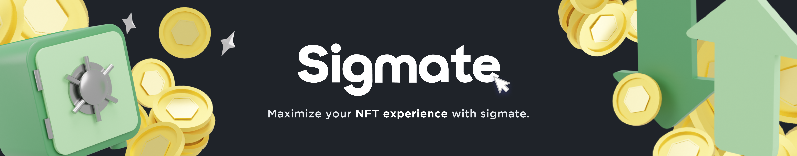

## WE ARE SIGMATE

<aside>
💡 Reliable, All-in-one NFT Information Platform
</aside>

> We bring everything you need to know about NFT.

# Aren’t you tired of today's NFT market? 😪

1. It’s hard to keep track of all the projects on Discord. 
2. Hard to find reliable information because the amount of information.
3. Lack of quantified metrics to evaluate NFTs

## ✅ These can all be solved in Sigmate.

<!--
**Here are some ideas to get you started:**

🙋‍♀️ A short introduction - what is your organization all about?
🌈 Contribution guidelines - how can the community get involved?
👩‍💻 Useful resources - where can the community find your docs? Is there anything else the community should know?
🍿 Fun facts - what does your team eat for breakfast?
🧙 Remember, you can do mighty things with the power of [Markdown](https://docs.github.com/github/writing-on-github/getting-started-with-writing-and-formatting-on-github/basic-writing-and-formatting-syntax)
-->
